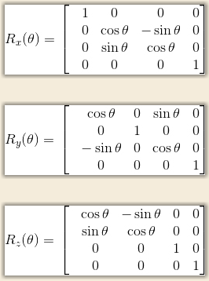

# Unity中的各种约定

## 组合旋转：

Q：如果我们需要同时绕着3个轴进行旋转，是先绕x轴、再绕y轴最后绕z轴旋转还是按其他的旋转顺序呢？

A：当我们直接给出(θx，θy，θz)这样的旋转角度时，需要定义一个旋转顺序。在Unity中，这个旋转顺序是zxy，这在旋转相关的API文档中都有说明（参见：入门精要4.5.7）

## 旋转矩阵助记小技巧：

Q：如何记住以下旋转矩阵绕X、Y、Z轴旋转时负号加在哪里？

A：如果是左手坐标系，两种方法助记：

1、加在1所在行的下一行的sin分量上

2、加在1所在列的前一列的sin分量上

> 注意：
>
> 1、右手坐标系，反方向取行或者列；
>
> 2、其余行都是cos-sin, sin-cos

## 矩阵的约定：

- Unity使用列矩阵

## 坐标空间的约定：

- 观察空间使用右手坐标系
  - 原因：Unity更接近使用OpenGL的坐标系规则
  - 注意事项：
    - 这种左右手坐标系之间的改变很少会对我们在Unity中的编程产生影响，因为Unity为我们做了很多渲染的底层工作，包括很多坐标空间的转换
    - 但是，如果读者需要调用类似Camera.cameraToWorldMatrix、Camera.worldToCameraMatrix（或者对应的Shader变量）等接口自行计算某模型在观察空间中的位置，就要小心这样的差异
    - 在进行[“深度空间重建”](https://ke.qq.com/webcourse/index.html?r=1664296129920#cid=3135212&term_id=105654894&taid=13280734667069164&type=3072&source=PC_COURSE_DETAIL&vid=3701925924099922785)时，由于在Unity使用的视角空间中，摄像机正向对应的z值均为负值，因此为了得到深度值的正数表示，我们需要对上面的结果取反
- 其余空间使用左手坐标系
  - 在从视图空间转换到裁剪空间时，裁剪矩阵会改变空间的旋向性：空间从右手坐标系变换到了左手坐标系
- 在Unity中，屏幕空间左下角的像素坐标是（0，0），右上角的像素坐标是(pixelWidth，pixelHeight)

## 关于齐次坐标除法（透视投影）：

- Unity选择使用OpenGL的齐次裁剪空间约定：x、y、z分量的范围都是[−1，1]
  - Unity通过提供Shader变量和ShaderAPI屏蔽了GL和D3D在裁剪空间约定上的差异性
- 齐次坐标除法发生在投影空间》屏幕空间变换阶段，而该变换是由GPU硬件完成的：
  - 在顶点阶段，我们的vs只负责准备用于进行齐次除法的投影空间顶点数据（xyz轴数据经过缩放、w值等于视图空间的-z）
  - 在片元阶段，GPU传入片元shader的POSITION数据是已经经过齐次坐标除法的NDC空间坐标数据
- 参考：要深入理解透视除法的具体实现过程，可以跟着《Unity小白的TA之路》的[“手写图形学算法”相关章节](https://ke.qq.com/webcourse/index.html?r=1664295335679#cid=3135212&term_id=105654894&taid=13280137666615020&type=3072&source=PC_COURSE_DETAIL&vid=5285890809037839882)进行学习

# 坐标空间与坐标变换

## 坐标空间：

### 局部空间/模型空间

> 物体自身坐标系

- 

#### [世界变换](https://ke.qq.com/webcourse/index.html#course_id=3135212&term_id=103259263&taid=10433300198840044&type=1024&vid=5285890809037839909)

> 将模型从其自身坐标转换到游戏世界坐标

### 世界空间：游戏世界的统一坐标系

- 

#### [视图变换](https://ke.qq.com/webcourse/index.html#course_id=3135212&term_id=103259263&taid=10433308788774636&type=1024&vid=5285890809037839882)

> 将游戏世界中的景物转换到摄像机视角进行观察

### 视图空间/摄像机空间

> 以摄像机位置为原点，摄像机朝向为轴向的坐标系

- 

#### [投影变换](https://ke.qq.com/webcourse/index.html#course_id=3135212&term_id=103259263&taid=10433308788774636&type=1024&vid=5285890809037839882)

>  将物体变换到裁剪空间

### [裁剪空间](https://ke.qq.com/webcourse/index.html#course_id=3135212&term_id=103259263&taid=10433308788774636&type=1024&vid=5285890809037839882)：

#### 平行投影：

- 

#### 透视投影

>  顶点的x/y/z值会被缩放；w值就是视图空间中的-z值，它记录了顶点靠摄像机的远近距离。顶点经过透视除法会变换到NDC空间

- 

#### 齐次坐标除法

> 在本空间下，经过==透视坐标除法/齐次坐标除法==（x/w, y/w, z/w）的点如果在NDC空间坐标范围内，则会被渲染，否则丢弃

### [NDC空间](https://ke.qq.com/webcourse/index.html#course_id=3135212&term_id=103259263&taid=10433308788774636&type=1024&vid=5285890809037839882)

- 
- OpenGL为单位立方体空间（x∈[-1,1], y∈[-1,1], z∈[-1,1]）
- DirectX为半立方体空间（x∈[-1,1], y∈[-1,1], z∈[0,1]）

#### 屏幕变换

> 将NDC空间下的点投影到屏幕像素坐标范围内

### [屏幕空间](https://ke.qq.com/webcourse/index.html#course_id=3135212&term_id=103259263&taid=10433308788774636&type=1024&vid=5285890809037839882)：

- 

#### 屏幕像素坐标空间

>  可见顶点的坐标范围介于(0,0)~(Screen.width,Screen.height)

#### 屏幕归一化坐标空间

>  可见顶点的坐标范围介于(0,0)~(1,1)

## 视频参考：

- [矩阵在3D游戏中的运用](https://ke.qq.com/webcourse/index.html#course_id=3135212&term_id=103259263&taid=10433300198840044&type=1024&vid=5285890809037839909)