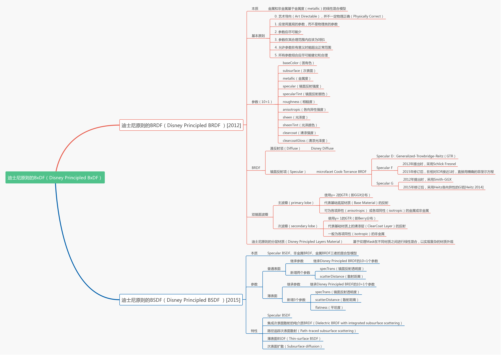
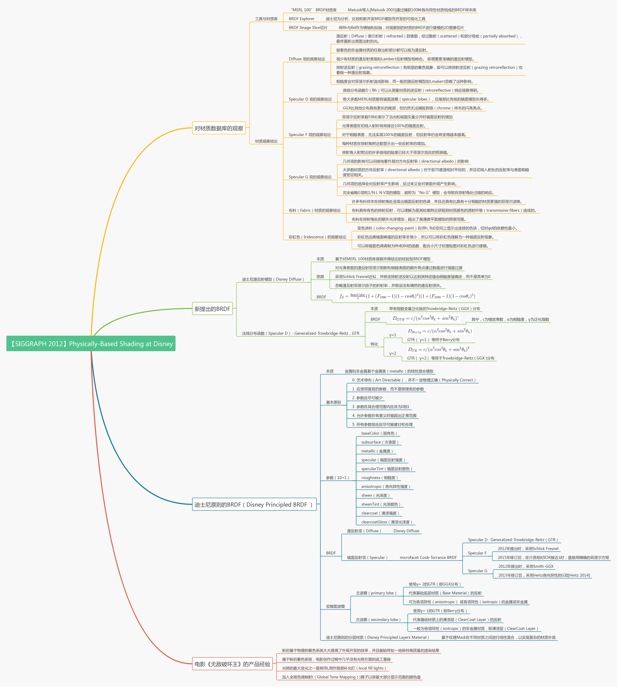
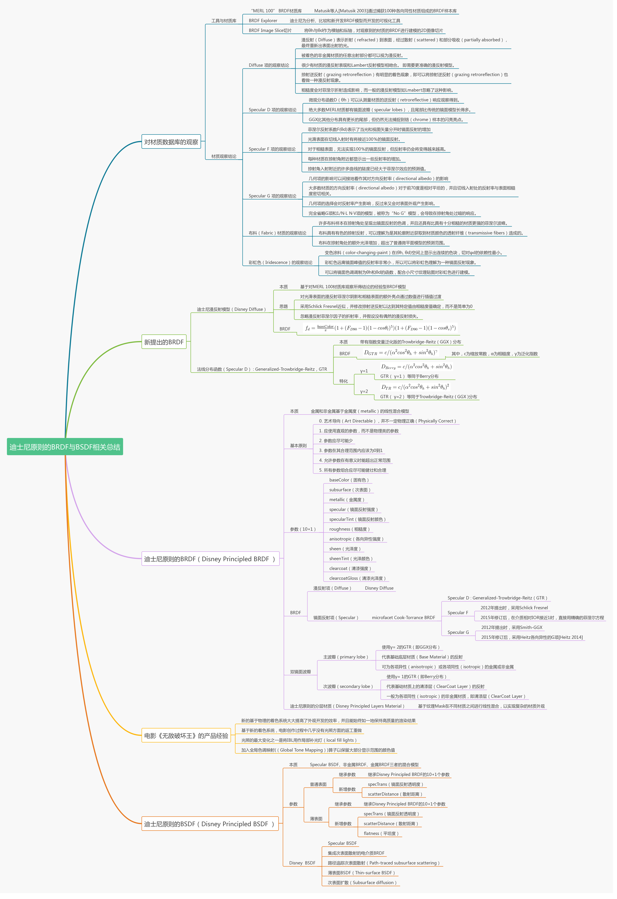

# 三种局部/经验/传统光照模型

## 光照模型公式

- ```tex
	C_{final}=C_{amb}+C_{diff}+C_{spec}+C_{emi}
	```

- ```tex
	C_{amb}
	```

	- 环境光颜色。在Unity的Lighting面板中设置，通过Shaderlab中的全局变量获取用户设置
	
		- ```tex
			C_{amb}=L_{amb}*M_{amb}
			```
	
- ```tex
	C_{diff}
	```

	- 漫反射颜色，与物体表面法线 *n* 和灯光方向*l*有关
	
	- ```tex
		C_{diff}=L_{diff}*M_{diff}*I_{diff}
		```
	
		- ```tex
			I_{diff}=max(dot(n,l), 0)
			```
	
- ```tex
	C_{spec}
	```

	- 镜面反射颜色，与观察方向有关

	- ```tex
		C_{spec}=L_{spec}*M_{spec}*I_{spec}
		```

		- Phong光照模型：

			- ```tex
				I_{spec} = max(dot(e,r)^{power}, 0)
				```

		- Blinn-Phong光照模型：

			- ```tex
				I_{spec} = max(dot(n,h), 0)^{power})
				```

			- h：半程（halfway）向量1

				- ```tex
					h=normalize(e+l)
					```

				- 

- ```tex
	C_{emis}
	```

	- 自发光颜色

	- ```tex
		C_{emis}=M_{emis}
		```

	- 其中，L表示灯光，M表示物体表面材质

## 漫反射计算简化（Lambert）

### Lambert：不计算高光反射

```tex
C_{final}=C_{amb}+C_{diff}
```

### Half Lambert：进一步解决Lambert背面过暗且无体积感问题

```tex
I_{diff}=dot(n,l)*0.5+0.5
```

- Half Lambert解决了物体表面背面得不到暗部光照细节的问题（背面只能通过环境光得到平均的环境光照，但实际应有带明暗信息的环境光细节）
- 

## 高光计算简化（Blinn-Phong）

### Phong与Blinn-Phong的区别：

- Phong使用视线与入射光线反射向量的夹角：


- Blinn-Phong使用halfway（视线与入射光线的中间方向）与normal的夹角：


### 效果区别：

- Phong因为视线与光反射向量夹角大于90度时取0（*91make.top: spec = max(dot(e,r),0)，如果e和r的夹角大于90度，则点乘值小于0*），因此有明显的边缘


- 由于Blinn-Phong所用计算的夹角往往小于Phong所使用的夹角（*91make.top: 夹角越小，点乘值越大*），因此Blinn-Phong的点积值更大，需要更大（往往为2-4倍）的exp值才能达成与Phong相似效果


# 菲涅尔效果模型

- 不需要死记公式
	- 菲涅尔系数：1-高光强度系数

# BSDF原理思维导图

